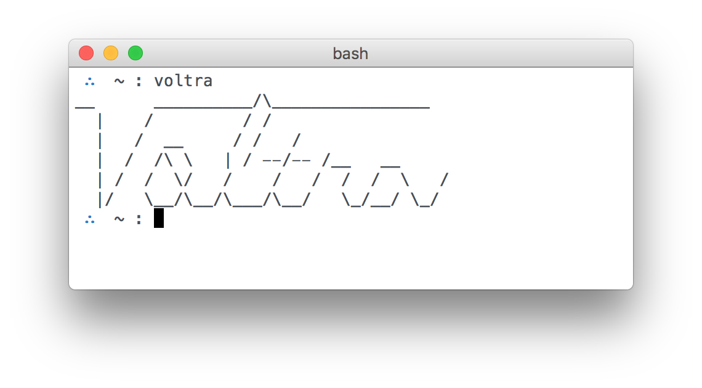

# voltra logo

## Usage

```bash
$ voltra
__      __________/\________________
  |    /         / /
  |   /  __     / /   /
  |  /  /\ \   | / ——/—— /__   __
  | /  /  \/   /    /   /  /  /  \   /
  |/   \__/\__/\___/\__/   \_/__/ \_/
```

```bash
$ voltra copy
__      __________/\________________
  |    /         / /
  |   /  __     / /   /
  |  /  /\ \   | / ——/—— /__   __
  | /  /  \/   /    /   /  /  /  \   /
  |/   \__/\__/\___/\__/   \_/__/ \_/

© Copyright Voltra Co., 2017
```

## Screenshots




## Installation

```bash
$ npm install -g voltraco/logo
```
